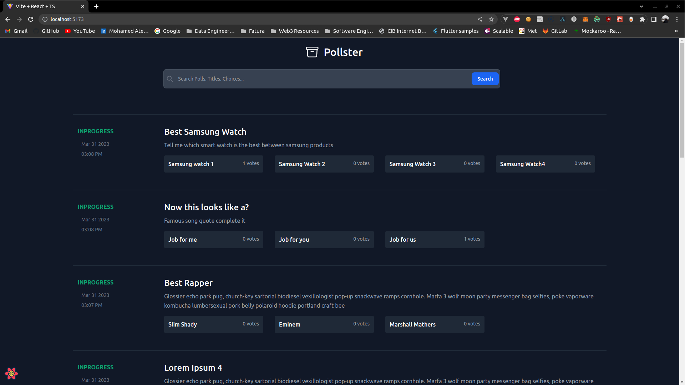

# Online-Voting-System
## Getting Started

### To run the backend


install venv if you dont already have it on your system
```
pip install pipenv
```
activate the virtual env
```
pipenv shell
```
install the packages from the requirments.txt file
```
pipenv install -r requirements.txt
```

cd into the folder
```
cd votingSystem
```
There is an sqlite database in this project if you wish to connect your own database dont forget to run
```
python manage.py makemigrations
```
```
python manage.py migrate
```
To start the backend
```
python manage.py runserver
```
Create a super user to access django admin portal
```
python manage.py createsuperuser
```
Make sure that you use this commands to run the cronjob responsible for checking expiry dates and changing the status automattically accordingly
```
python manage.py crontab add
```

Dont forget to create a .env file and add the variables as per the .env.example file

## SQL Tables

Polls Table


| id | title | status | description | created_at | end_date |
| --- | --- | --- | --- | --- | --- |
| 1 | poll1 | inprogress | aa | 00 | 00 |
| 2 | poll2 | inprogress | ss | 00 | 00 |

Choices Table

| id | choice_text | numberOfVotes | poll_id (fk) | 
| --- | --- | --- | --- | 
| 1 | choice 1 | 3 | 1 |  
| 2 | choice 2 | 4 | 1 |  
| 3 | choice 3 | 5 | 1 |  
| 4 | choice 1.1 | 1 | 2 |  


Voters Table

| id | email | choice_id(fk) | is_confirmed | otp_timestamp | poll_id (fk) | created_at |
| --- | --- | --- | --- | --- | --- | --- |
| 1 | johndoe@gmail.com | 2 | No |  | 1 |  |
| 2 | johndoe@gmail.com | 4 | No |  |  |  |


## Endpoints in the backend

### Get Polls (Limit, offset and search are optional i.e the query will run without them normally)
```
http://localhost:8000/api/polls/?limit=10&offset=0&search=<search term>
```
```
response example
{
    "count": 1,
    "next": null,
    "previous": null,
    "results": [
        {
            "id": 31,
            "title": "Presidential Poll",
            "status": "inProgress",
            "description": "This poll is about who was/is the best president of egypt",
            "created_at": "2023-03-13T13:02:30.708919Z",
            "end_date": "2023-03-29T13:02:12Z",
            "choices": [
                {
                    "id": 68,
                    "choice_text": "Jimmy",
                    "number_of_votes": 0
                },
                {
                    "id": 69,
                    "choice_text": "Mubarak",
                    "number_of_votes": 0
                },
                {
                    "id": 70,
                    "choice_text": "Sadat",
                    "number_of_votes": 1
                },
                {
                    "id": 71,
                    "choice_text": "You know who",
                    "number_of_votes": 0
                }
            ]
        }
    ]
}
```
### Vote on Polls

```
http://localhost:8000/api/vote_on_polls

body =
    {
    "poll_id":Poll id from Polls Table,
    "choice_id":choice id from Choices table,
    "email":"recipient email"
}
```

```
response ={
    "error or success":"message body"
}
```
* Sends an email to the user with the otp and doing some checks
* If otp expired it sends another one if not waits till it expires or confirmed

###Confirm Vote

```
http://localhost:8000/api/confirm_vote

body ={
    
    "otp":otp recieved in mail,
    "poll_id":Poll id from Polls Table,
    "choice_id":Choice id from Choices Table,
    "email":"recipeient email"
}

```
```
response
{
    "success or error": "message body"
}
```

* Checks if the otp is valid and confirms the vote

## To run the frontend

cd into the fronted
```
cd frontend
```

install packages
```
yarn
```
start the project 
```
yarn dev
```

### The Homepage should look something like this

